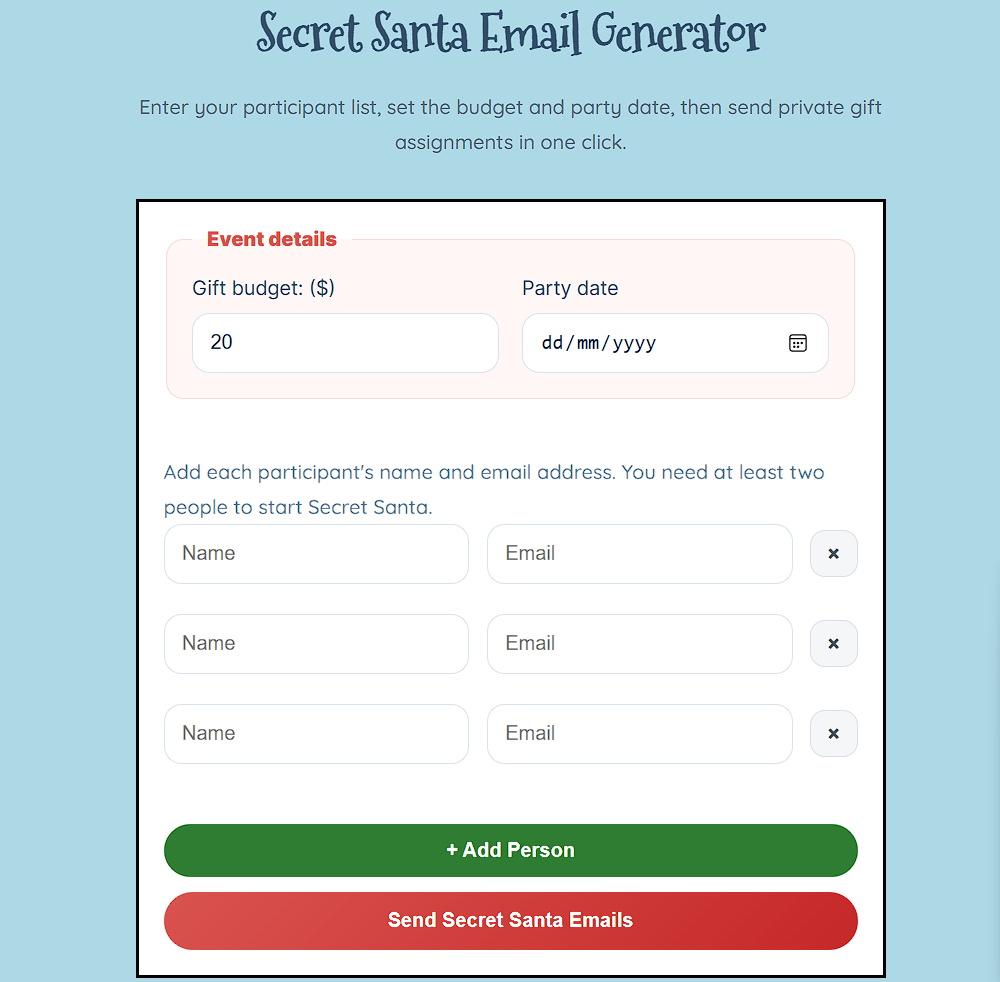
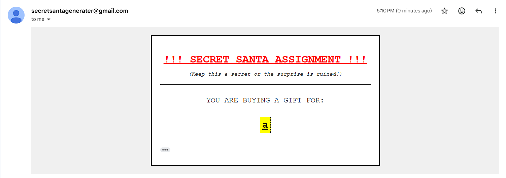
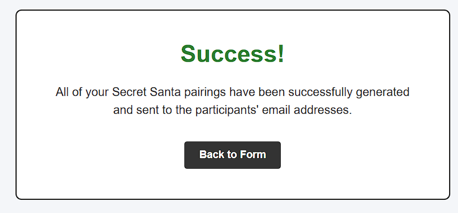
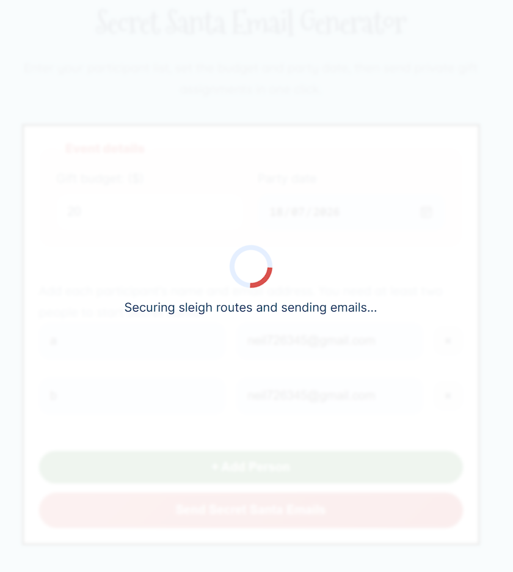

# The Automated Secret Santa Email System



A web application built using **Python (Flask)** and **HTML5/CSS3** that automated the process of organising a Secret Santa.

This website allows users can set an event date, a budget and add participants by providing their name and email. The system will then processes the algorithm to shuffle up the participants and distribute holiday themed cards through email directly to each person's inbox without revealing pairing to anybody.



---

## 1. The Problem Being Solved
Organizing a traditional Secret Santa for a group of friends, family, or coworkers usually presents two major issues:
1. **The "Spoiler" Problem:** The person organizing the draw has to manually pull names out of a hat or assign pairings, completely ruining the surprise for themselves.
3. **The "Swapsies" Cheaters:** Some people tend to swap with others just to get their friend's name or don't like to give a present to a particular person
2. **The "Self-Match" Error:** People frequently draw their own names out of physical hats, forcing the group to throw all the papers back in and restart the entire process from scratch.

**The Solution:** This app creates a completely automated, blind environment. The organizer fills out the event details and names, hits a single button, and the code  shuffles and emails the cards directly to players' inboxes. The organizer also has no idea about who got who, keeping the magic of the game alive! Additionally, methods of cheating will also be impossible, with automated emails from a separate account, it's much harder to swap online than we pieces of paper.

---

##2. Working & Usable Project Setup

### File Directory Structure
```text
📁 secret-santa-app/
│
├── 📁 static/
│   └── style.css          # Central stylesheet for clean user layout
│
├── 📁 templates/
│   └── index.html         # User input dashboard layout
│
├── .env                   # Ignored by Git; holds private server keys
├── requirements.txt       # Production library packages list
└── secret_santa.py        # Central Flask application and logic engine

(Just got AI to make this file tree setup.)
```
---

##3. Thoughtful Execution:

Instead of a basic single-shuffle, the script duplicates the participant tracker array and enters a defensive validation loop. If any player shares an identical index coordinate matching across both lists (meaning if a user accidentally drew themselves), a conditional flag catches it, breaks the current sequence, and forces a complete recalculation reshuffle until a valid matrix configuration is reached:

Here is the code:
```lang
 targets = participants.copy()
while True:
    random.shuffle(targets)
    matched_self = False
    for i in range(len(participants)):
        if participants[i][0] == targets[i][0]:
            matched_self = True
            break
    if not matched_self:
        break
```

---

##4 Major Quality-of-Life (QoL) Improvements:

# QoL Upgrade 1: Dynamic Participant Control:
Instead of forcing users to fill out a static, rigid number of text inputs in raw code, the frontend index code uses a little more JavaScript control selectors to allow organizers to add or remove player rows with a single click.

# QoL Upgrade 2: Dynamic Participant Control:
Rather than hardcoding rules into text, the application uses the basic numeric budget limits and raw browser-synchronized calendar date-pickers. This data be easily taken from Flask and integrated straight into the emails.

# QoL Upgrade 3: Full-Screen Loading:
Sending server-side SMTP emails to multiple addresses over the internet takes a few seconds. To prevent stupid, idiot, impatient, annoying ahh users from double-clicking the button (which would break the logic or send duplicate emails), I made a themed load-screen that pops up instantly when submitting to lock the form and signal that emails are being sent.


 ## Features:

 * Add or remove player rows dynamically on the frontend through JavaScript.
 * Raw date picking and numeric budget fields that allow data to be smoothly transferred to the backend.
 * A conditional loop that ensures no participant is ever assigned to themselves.
 * Implements environmental variable masking (`.env`) for private mail configurations.
  They were like SENDER_EMAIL and SENDER_PASSWORD.
 * A full-screen loading animation to show users that the script is actually loading/working in the backend even though the frontend is frozen (this is to stop impatient people from spamming the button and possibly crashing the system)
 * Sends styled holiday card layouts through a secure background SMTP connection to GMAILs servers.


This project was for Stardance.




